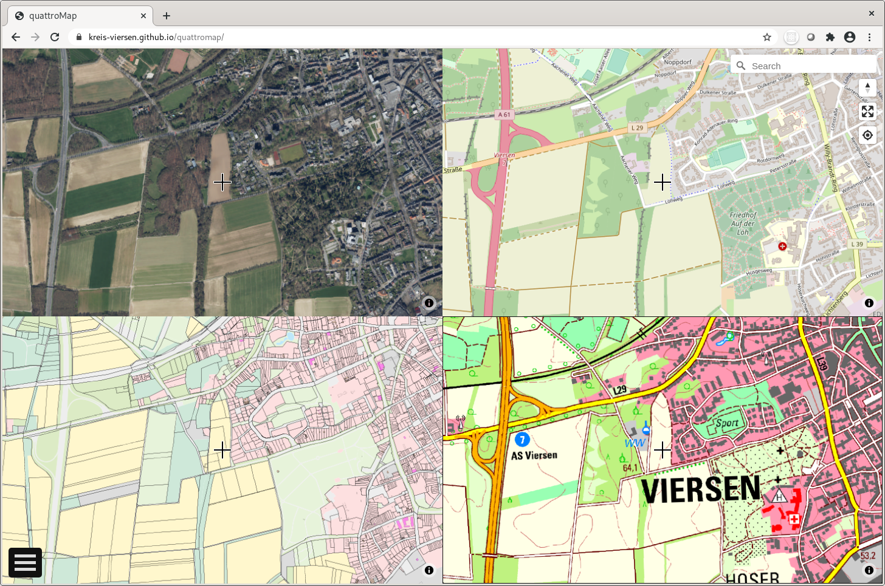
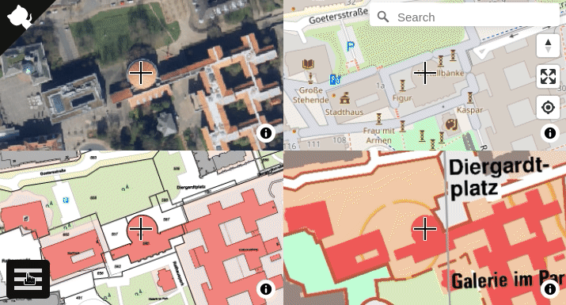

# QuattroMap
[][github-action-ci]
[][license]

[github-action-ci]: https://github.com/kreis-viersen/quattromap/actions?query=workflow%3Aci
[license]:          https://tldrlegal.com/license/mit-license

<a href="https://kreis-viersen.github.io/quattromap/"></a>

Kreiseigene Kartenanwendung, die vor allem die Außendiensttätigkeiten unterstützen kann.

Unter https://kreis-viersen.github.io/quattromap/ ist eine Demo des Tools von jedem internetfähigen Gerät, wie Tablet, Smartphone, Laptop und PC, erreichbar.

Mit Hilfe der Anwendung können bis zu 4 verschiedene Karten mit gleichem Kartenausschnitt gleichzeitig dargestellt werden.
Über die Schaltfläche in der linken unteren Ecke gelangt man zu den Einstellungen der Kartenfenster. Zur Auswahl der Kartenhintergründe stehen z. B.
Luftbilder, Liegenschaftskataster, geplanteGebäude oder OpenStreetMap zur Verfügung.

In den Kartenfenstern können auch Überlagerungen (Overlays) benutzt werden, um bspw. Luftbilder und geplante Gebäude übereinander zu legen.

Am rechten Bildschirmrand gibt es eine Suchfunktion (Mapbox GL Geocoder Control: https://github.com/mapbox/mapbox-gl-geocoder) sowie die Möglichkeit den Kartenausschnitt und den eigenen Standort über die Standortbestimmung des Geräts anzuzeigen (Standortbestimmung muss im Gerät eingeschaltet bzw. erlaubt sein).
Dazu gibt es dort eine Schaltfläche, um die Anwendung im Vollbild anzuzeigen. Ein Klick auf das Kompass-Symbol richtet die Karte(n) wieder nach Norden aus.

### Messwerkzeuge

Sobald nur eine Karte angezeigt wird, stehen Messwerkzeuge zur Verfügung:
- LineString: zum Messen eine Entfernung in Metern
- Polygon: zum Messen einer Fläche in Quadratmetern

Einfach das gewünschte Werkzeug auswählen, den LineString oder das Polygon auf der Karte zeichen und mit einem Klick auf den letzten Stützpunkt abschließen:



## Aktuell verfügbare Dienste

### Layer

|Name|Art|URL|Dienste Layer|
|:---|:---|:---|:---|
|**Geobasis NRW**||||
|NRW Luftbild Farbe|WMS|https://www.wms.nrw.de/geobasis/wms_nw_dop?SERVICE=WMS&VERSION=1.3.0&REQUEST=GetCapabilities|nw_dop_rgb|  
|NRW vDOP Farbe|WMS|https://www.wms.nrw.de/geobasis/wms_nw_vdop?SERVICE=WMS&VERSION=1.3.0&REQUEST=GetCapabilities|nw_vdop_rgb|  
|NRW ALKIS FLURSTÜCKE|WMS|https://www.wms.nrw.de/geobasis/wms_nw_alkis?SERVICE=WMS&VERSION=1.3.0&REQUEST=GetCapabilities|adv_alkis_flurstuecke|  
|NRW Amtliche Basiskarte (ABK)|WMS|https://www.wms.nrw.de/geobasis/wms_nw_abk?SERVICE=WMS&VERSION=1.3.0&REQUEST=GetCapabilities|WMS_NW_ABK|  
|NRW Alkis TN|WMS|https://www.wms.nrw.de/geobasis/wms_nw_alkis?SERVICE=WMS&VERSION=1.3.0&REQUEST=GetCapabilities|adv_alkis_tatsaechliche_nutzung|
|NRW Schummerung|WMS|https://www.wms.nrw.de/geobasis/wms_nw_dgm-schummerung?SERVICE=WMS&VERSION=1.3.0&REQUEST=GetCapabilities|nw_dgm-schummerung_pan|
|NRW DTK|WMS|https://www.wms.nrw.de/geobasis/wms_nw_dtk?SERVICE=WMS&VERSION=1.3.0&REQUEST=GetCapabilities|nw_dtk_col|
|**OpenStreetMap**||||
|OSM Mapnik|XYZ Tiles|https://www.openstreetmap.org||
|**RVR**||||
|RVR Luftbild Farbe|WMS|https://geodaten.metropoleruhr.de/dop/dop?SERVICE=WMS&VERSION=1.3.0&REQUEST=GetCapabilities|dop|
|**KRZN-Dienste**||||
|Kreis Viersen ALKIS|WMS|https://gdi-niederrhein-geodienste.de/flurkarte_verb_sammeldienst/service?SERVICE=WMS&VERSION=1.3.0&REQUEST=GetCapabilities|FlurkarteAdV_Viersen|
|Stadt Krefeld ALKIS|WMS|https://gdi-niederrhein-geodienste.de/flurkarte_verb_sammeldienst/service?SERVICE=WMS&VERSION=1.3.0&REQUEST=GetCapabilities|FlurkarteAdV_Krefeld|
|Kreis Wesel ALKIS|WMS|https://gdi-niederrhein-geodienste.de/flurkarte_verb_sammeldienst/service?SERVICE=WMS&VERSION=1.3.0&REQUEST=GetCapabilities|FlurkarteAdV_Wesel|
|Kreis Kleve ALKIS|WMS|https://gdi-niederrhein-geodienste.de/flurkarte_verb_sammeldienst/service?SERVICE=WMS&VERSION=1.3.0&REQUEST=GetCapabilities|FlurkarteAdV_Kleve|
|Stadt Bottrop ALKIS|WMS|https://gdi-niederrhein-geodienste.de/flurkarte_verb_sammeldienst/service?SERVICE=WMS&VERSION=1.3.0&REQUEST=GetCapabilities|Flurkarte_Bottrop|
|Kreis Viersen ALKIS light|WMS|https://geoservices.krzn.de/security-proxy/services/wms_kvie_alkis_light?SERVICE=WMS&VERSION=1.3.0&REQUEST=GetCapabilities|nutzungsarten, flurstuecke, gebaeude, lagebezeichnungen|
|Kreis Viersen Geplante Gebäude|WMS|https://geoservices.krzn.de/security-proxy/services/wms_kvie_geplgeb?SERVICE=WMS&VERSION=1.3.0&REQUEST=GetCapabilities|kvie_geplgeb|
|**Nationaal Georegister (NL)**||||
|NL Luftbild Farbe|WMS|https://geodata.nationaalgeoregister.nl/luchtfoto/rgb/wms?SERVICE=WMS&VERSION=1.3.0&REQUEST=GetCapabilities|Actueel_ortho25|  
|**Kreis Warendorf**||||
|Kreis Warendorf ALKIS|WMS|https://www.kreis-warendorf.de/arcgis/service2?SERVICE=WMS&VERSION=1.3.0&REQUEST=GetCapabilities|alkis_lieka|  
|Kreis Warendorf ABK 1:5000|WMS|https://www.kreis-warendorf.de/arcgis/service2?SERVICE=WMS&VERSION=1.3.0&REQUEST=GetCapabilities|abk5000|  
|**Kreis Steinfurt**||||
|Kreis Steinfurt ALKIS|WMS|https://gis.kreis-steinfurt.de/arcgis13/services/Geobasisdaten/Geobasisdaten_Kreissuebersichtskarte_DTK_farbe/MapServer/WMSServer?SERVICE=WMS&VERSION=1.3.0&REQUEST=GetCapabilities|0|
|Kreis Steinfurt ABK|WMS|https://gis.kreis-steinfurt.de/arcgis13/services/Geobasisdaten/Geobasisdaten_ABK_farbe/MapServer/WMSServer?SERVICE=WMS&VERSION=1.3.0&REQUEST=GetCapabilities|0|

### Overlays

Zusätzlich zu den unter [Layer](https://github.com/kreis-viersen/quattromap#layer) gelisteten Diensten sind als Overlay verfügbar:

|Name|Art|URL|Dienste Layer|
|:---|:---|:---|:---|
|**Geobasis NRW**||||
|NRW Luftbild Overlay|WMS|https://www.wms.nrw.de/geobasis/wms_nw_dop_overlay?SERVICE=WMS&VERSION=1.3.0&REQUEST=GetCapabilities|WMS_NW_DOP_OVERLAY|  
|NRW LINFOS|WMS|https://www.wms.nrw.de/umwelt/linfos?SERVICE=WMS&VERSION=1.3.0&REQUEST=GetCapabilities|Naturschutzgebiete, Landschaftsschutzgebiet|


## Develop

```bash
# clone the repository
git clone https://github.com/kreis-viersen/quattromap/
cd quattromap
```
Install the deps, start the dev server and open the web browser on `http://localhost:8080/`.

```bash
# install dependencies
npm install
# start dev server
npm start
```

The build process will watch for changes to the filesystem, rebuild and autoreload quattroMap. However note this from the [webpack-dev-server docs](https://webpack.js.org/configuration/dev-server/):

> webpack uses the file system to get notified of file changes. In some cases this does not work. For example, when using Network File System (NFS). Vagrant also has a lot of problems with this. In these cases, use polling. ([snippet source](https://webpack.js.org/configuration/dev-server/#devserverwatchoptions-))

```bash
# build the app
npm run build
```
Once the build is finished, you'll find it at `dist/`.

```bash
# publish files to a gh-pages branch on GitHub
npm run deploy
```

### Search

For the search functionality https://github.com/mapbox/mapbox-gl-geocoder is used.

For your own quattroMap please use your own access token:
https://docs.mapbox.com/help/how-mapbox-works/access-tokens/.
