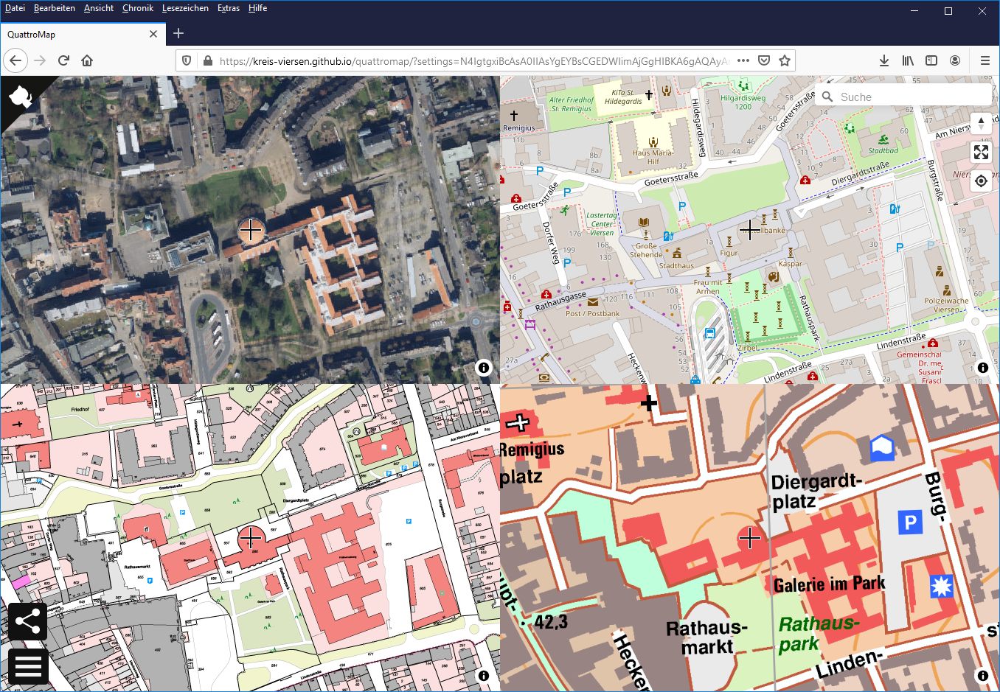

# quattroMap
[][github-action-ci]
[][license]

[github-action-ci]: https://github.com/kreis-viersen/quattromap/actions?query=workflow%3Aci
[license]:          https://tldrlegal.com/license/mit-license

<a href="https://kreis-viersen.github.io/quattromap/"></a>

Kreiseigene Kartenanwendung, die vor allem die Außendiensttätigkeiten unterstützen kann. 

Unter https://kreis-viersen.github.io/quattromap/ ist eine Demo des Tools von jedem internetfähigen Gerät, wie Tablet, Smartphone, Laptop und PC, erreichbar. 

Mit Hilfe der Anwendung können bis zu 4 verschiedene Karten mit gleichem Kartenausschnitt gleichzeitig dargestellt werden.
Über die Schaltfläche in der linken unteren Ecke gelangt man zu den Einstellungen der Kartenfenster. Zur Auswahl der Kartenhintergründe stehen z. B.
Luftbilder, Liegenschaftskataster, geplanteGebäude oder OpenStreetMap zur Verfügung. 

In den Kartenfenstern können auch Überlagerungen (Overlays) benutzt werden, um bspw. Luftbilder und geplante Gebäude übereinander zu legen.

Am rechten Bildschirmrand gibt es eine Suchfunktion (Mapbox GL Geocoder Control: https://github.com/mapbox/mapbox-gl-geocoder) sowie die Möglichkeit den Kartenausschnitt und den eigenen Standort über die Standortbestimmung des Geräts anzuzeigen (Standortbestimmung muss im Gerät eingeschaltet bzw. erlaubt sein).
Dazu gibt es dort eine Schaltfläche, um die Anwendung im Vollbild anzuzeigen. Ein Klick auf das Kompass-Symbol richtet die Karte(n) wieder nach Norden aus. 


## Develop

```bash
# clone the repository
git clone https://github.com/kreis-viersen/quattromap/
cd quattromap
```
Install the deps, start the dev server and open the web browser on `http://localhost:8080/`.

```bash
# install dependencies
npm install
# start dev server
npm start
```

The build process will watch for changes to the filesystem, rebuild and autoreload quattroMap. However note this from the [webpack-dev-server docs](https://webpack.js.org/configuration/dev-server/):

> webpack uses the file system to get notified of file changes. In some cases this does not work. For example, when using Network File System (NFS). Vagrant also has a lot of problems with this. In these cases, use polling. ([snippet source](https://webpack.js.org/configuration/dev-server/#devserverwatchoptions-))

```bash
# build the app
npm run build
```
Once the build is finished, you'll find it at `dist/`.

```bash
# publish files to a gh-pages branch on GitHub
npm run deploy
```

### Search

For the search functionality https://github.com/mapbox/mapbox-gl-geocoder is used.

For your own quattroMap please use your own access token: 
https://docs.mapbox.com/help/how-mapbox-works/access-tokens/.
